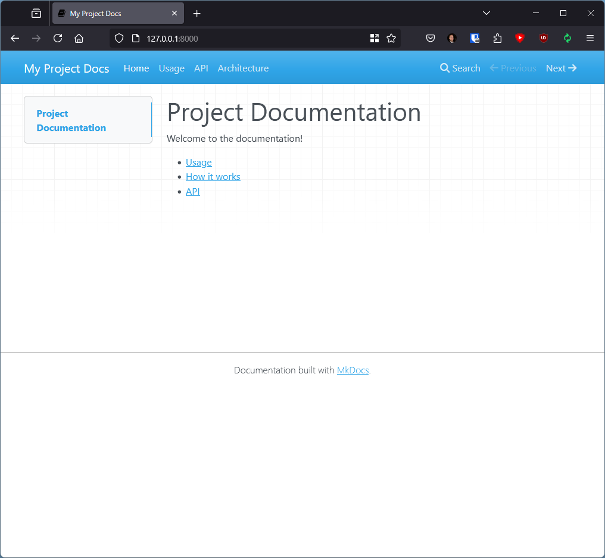

# Embedded documentation example
# ==================================

## Project Documentation

[Documentation](docs/index.md)

## Bonus: use `mkdocs` + `mkdocs-material` locally

```
pip install mkdocs mkdocs-material
mkdocs serve
```

You can now view documentation browsing [http://127.0.0.1:8000/](http://127.0.0.1:8000/).


